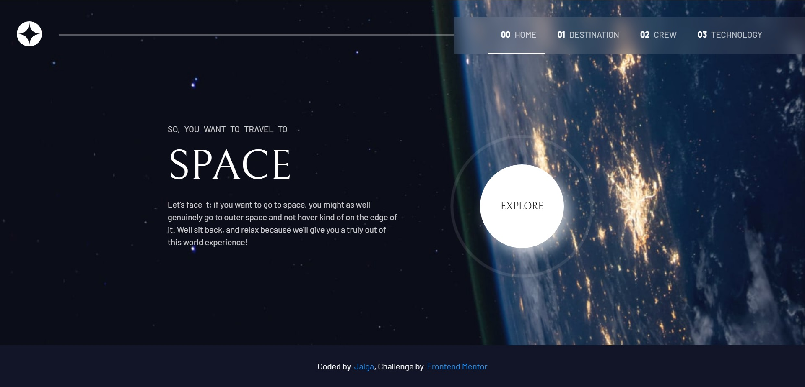
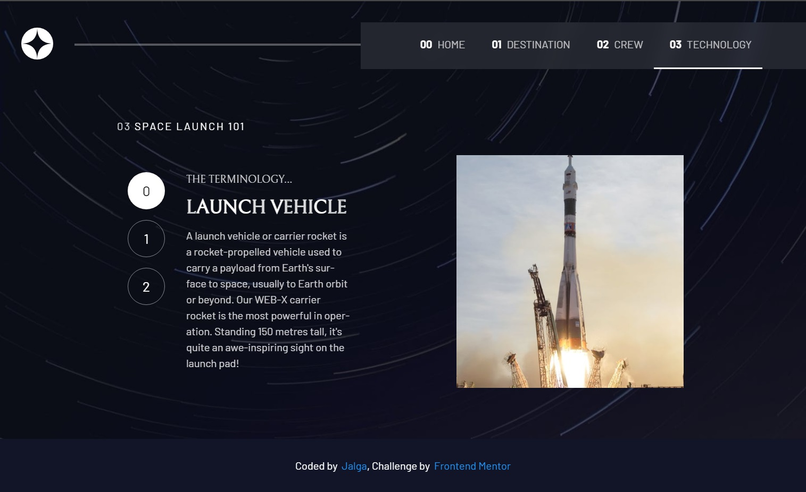
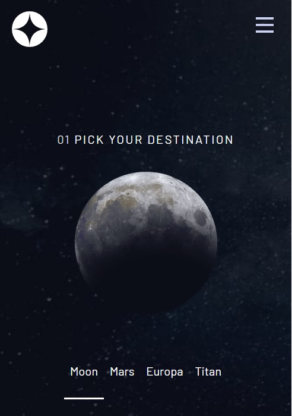

# Frontend Mentor - Space tourism website

## Table of contents

-   [Overview](#overview)
    -   [The challenge](#the-challenge)
    -   [Screenshot](#screenshot)
    -   [Links](#links)
-   [My process](#my-process)
    -   [Built with](#built-with)
    -   [What I learned](#what-i-learned)
    -   [Continued development](#continued-development)
    -   [Useful resources](#useful-resources)
-   [Author](#author)
-   [Acknowledgments](#acknowledgments)

## Overview

### The challenge

Users should be able to:

-   View the optimal layout for each of the website's pages depending on their device's screen size
-   See hover states for all interactive elements on the page
-   View each page and be able to toggle between the tabs to see new information

### Screenshot

<p float="left">
  
  
  
</p>


### Links

-   Solution URL: [Add solution URL here](https://github.com/coder-96/fm-space-tourism-website-src)
-   Live Site URL: [Add live site URL here](https://your-live-site-url.com)

## My process

### Built with

-   React JS
-   HTML5
-   CSS3
-   Flexbox
-   CSS Grid
-   Tailwind CSS
-   Mobile-first workflow
-   [React](https://reactjs.org/) - JS library

### What I learned

Improved my frontend skills once again, and gained more knowledge overall on React JS, and React routes.

```css
.one.rotate {
    animation: 10s linear infinite rotate-con;
}

@keyframes rotate-con {
    from {
        transform: rotate(0deg);
    }
    to {
        transform: rotate(360deg);
    }
}
```

```jsx
useEffect(() => {
    // Fetch post using the postSlug
    let planetItem = document.querySelector(`#${postSlug}`);
    planetItem.classList.add("active");
    planetItem.classList.remove("hover_effect");
    getData(postSlug);
    return () => {
        planetItem.classList.remove("active");
        planetItem.classList.add("hover_effect");
    };
}, [postSlug]);
```

### Continued development

I'm focused on perfecting my skills by building more realistic projects.

### Useful resources

- [MDN Web Docs](https://developer.mozilla.org/en-US/) - helped me find answers when I got stuck.

## Author

- Website - [Jalga](https://github.com/coder-96)

- Frontend Mentor - [@coder-96](https://www.frontendmentor.io/profile/coder-96)

## Acknowledgments

I thank my family for supporting me on my way to becoming a Developer. 